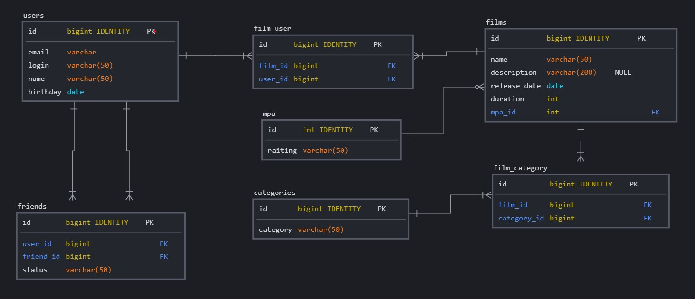

### ER diagram

[](src/main/resources/sql/ER diagram.jpg)

Для реализации зависимости многие ко многим использованы
три дополнительные таблицы:
- friends - для связи пользователей и статуса дружбы с другими пользователями
- film_user - для связи лайков пользователей фильмам
- film-category - для связи фильмов с категориями

1. #### Find all user friends:
```SQL
    SELECT friend_id
    FROM friends
    WHERE user_id=?;
```
2. #### Find first 10 most popular films:
```SQL
    SELECT f.name AS film,
    COUNT(fu.user_id) AS popularity
    FROM films AS f
    LEFT JOIN film_user AS fu ON f.id=fu.film_id
    GROUP BY film
    ORDER BY popularity DESC
    LIMIT 10;
```
    